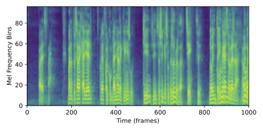

<div align="center">

# Convmelspec: Convertible Melspectrograms via 1D Convolutions

<!-- [](https://youtu.be/IZp455wiMk4) -->

 <br>
<b>Convertible melspectrograms for ONNX and CoreML.</b>

</div>

# About

For a large class of audio neural network models, a Mel-scaled short-time Fourier transform or Melspectrogram operator is needed. The Melspectrogram operator is not typically implemented in on-device machine learning frameworks such CoreML (and previously ONNX), however, which significantly complicates the cross-platform deployment of audio machine learning models. To mitigate this, here we reuse standardized and interoperable neural network operators to  implement a convertible Melspectrogram by implementing the short-time Fourier transform (STFT) via 1D convolutions.

Beyond basic functionality (known to many), however, we offer an ability to trade-off module storage size and inference speed. To do so, we provide three modes of how we compute the discrete Fourier transform (DFT) matrix needed for the STFT: store, input, and on-the-fly. Our `store` mode precomputed the DFT matrix and stores it directly in your model file (fastest inference, larger model, easy), our `input` mode assumes the DFT matrix is provided as an input parameter to your model (fast inference speed, small model, hard), and our `on-the-fly` model dynamically constructs the DFT matrix at inference time (slower inference, small model, easy). Our module also can be used as a pass-through to torchaudio for training and then converted to DFT mode for conversion and is setup to be compatible to the recent native ONNX stft that still requires a custom compilation setup. Further, we also show how to convert the native torchaudio melspectrogram layers via CoreML model intermediate language ops directly.

In total, we implement Melspectrograms in a standardized cross-platform way with minimal impact on model size and reasonble speed. Try it out, let us know how it goes, and submit PRs to fix!


# Setup

* Create new python environment via pip or conda

```
conda create -n convmelspec python=3.9 -y
conda activate convmelspec
```


* Install the source code

```
# Install editable from source
cd <convmelspec>

# Install as editable (for developers)
pip install -e .

# Alterntatively, install read-only
pip install .
```

# Usage

The easiest way to convert your own PyTorch models to ONNX and CoreML is to use our custom `ConvertibleSpectrogram` module within your model as opposed to directly using torchaudio. Once you do this, you can then export to ONNX or CoreML with a few lines of code. Internally, will use torchaudio directly or implement the required short-time Fourier transform operations using 1D convolutions, depending on the mode of operation. For CoreML, we further show how you can use  CoreML's Model Intermediate Language (MIL) to implement the short-time Fourier transform (again using 1D convs) and not need to use our layer at all.

```
import torch
import librosa
import numpy as np
from convmelspec.stft import ConvertibleSpectrogram as Spectrogram
import coremltools as ct

# Load an example audio file
x = torch.zeros(1, 16000)

# Create the layer
melspec = Spectrogram(
    sr=sr,
    n_fft=1024,
    hop_size=512,
    n_mel=64,
)

# Switch to eval for inference and conversion
melspec.eval()

```

## Training

For training, we recommend you create and use the layer in `torchaudio` mode. Once complete, you can change the mode of the layer to one of the other options that convert to ONNX and CoreML.


## Convert to ONNX

To convert your model to ONNX, you can use the built-in PyTorch onnx export function.

```

# Set the export mode (pick one)
melspec.set_mode("DFT", "input")
melspec.set_mode("DFT", "store")
melspec.set_mode("DFT", "on_the_fly")

# Export to ONNX
output_path = '/tmp/melspec.onnx'
torch.onnx.export(melspec, x, output_path)
```

## Convert to ONNX with Opset 17

The ONNX standard and runtime have added support for an STFT operator and related functionality (e.g. https://github.com/pytorch/audio/issues/982). As noted, however, PyTorch itself does not yet support exporting with opset 17, so a custom build of PyTorch is required (this works, but not yet documented here).


## Convert to CoreML

To convert your model to CoreML, you can use the coremltools Python package

```

# Export to CoreML
output_path = '/tmp/melspec.mlmodel'

# Set the export mode (pick one)
melspec.set_mode("DFT", "input")
melspec.set_mode("DFT", "store")
melspec.set_mode("DFT", "on_the_fly", coreml=True)

# Trace the model
traced_model = torch.jit.trace(melspec, x)

# Convert traced model to CoreML
input_tensors = [ct.TensorType(name="input", shape=(x.shape))]
mlmodel = ct.convert(model=traced_model,
                     inputs=input_tensors,
                     compute_units=ct.ComputeUnit.ALL,
                     minimum_deployment_target=None)

# Save to disk
mlmodel.save(output_path)

```

## Convert to CoreML via MIL

In addition to using our PyTorch layer to convert to CoreML, we also provide an example of how to use native torchaudio melspectrogram together with CoreMLTools model intermediate language (MIL) operators for conversion. To do this, please see the example below and corresponding unit tests.

The MIL implementation is provided as an illustrative example, but should not regularly be used in favor of the native STFT conversion implementation provided in coremltools.

```
import torchaudio

output_path = '/tmp/melspec-mil.mlmodel'

# Use native torchaudio melspec + CoreMLTools MIL
melspec = torchaudio.transforms.MelSpectrogram(
                sample_rate=16000,
                n_fft=1024,
                hop_length=512,
                power=2.0)

# Trace model
traced_model = torch.jit.trace(melspec, x)

# Convert traced model to CoreML
input_tensors = [ct.TensorType(name="input", shape=(x.shape))]
mlmodel = ct.convert(model=traced_model,
                     inputs=input_tensors,
                     compute_units=ct.ComputeUnit.ALL,
                     minimum_deployment_target=None)

# Save to disk
mlmodel.save(output_path)

```


## Unit test

To run our unit tests and inspect code examples for each mode of operation per platform, please see below.

```
cd <convmelspec>

python -m unittest discover tests
```

# License and Citation

This code is licensed under an Apache 2.0 license. If you use code from this work for academic publications, pleace cite our repo!:

```BibTex
@misc{convmelspec,
  author = {Nicholas J. Bryan, Oriol Nieto, Juan-Pablo Caceres},
  title = {Convmelspec: Melspectrograms for On-Device Audio Machine Learning},
  year = {2022},
  publisher = {GitHub},
  journal = {GitHub repository},
  howpublished = {\url{http://github.com/adobe-research/convmelspec}},
}
```

# Authors

Contributors include [Nicholas J. Bryan](https://njb.github.io), [Oriol Nieto](https://www.urinieto.com/about/), and [Juan-Pablo Caceres](https://research.adobe.com/person/juan-pablo-caceres/).
